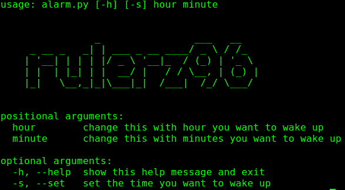

# LessSleep Alarm

LessSleep Alarm is a python alarm which helps me to wake up early in the morning.

I hope that this one helps people like me who have trouble getting up from bed.

I use this for 2 years and for me is very helpful.

## Logic behind it

The logic is pretty simple.

 - You need to set up hour and minute when you want to wake up
 
 - When the given time has come, the alarm will set master volume to 100%

 - The alarm will use ```espeak``` to convert a text to voice message.

 - The alarm will use ```mpg123``` to play a mp3 file from sound directory.

 - The ```espeak``` and ```mpg123``` steps will run 30 times.

 - You can use ```Ctrl-C``` to close the alarm. Press it multiple times.

## Dependencies

## eSpeak

eSpeak is a compact open source software speech synthesizer for English and other languages, for Linux and Windows.   http://espeak.sourceforge.net

eSpeak uses a "formant synthesis" method. This allows many languages to be provided in a small size. The speech is clear, and can be used at high speeds, but is not as natural or smooth as larger synthesizers which are based on human speech recordings.

eSpeak is available as:

A command line program (Linux and Windows) to speak text from a file or from stdin.
A shared library version for use by other programs. (On Windows this is a DLL).
A SAPI5 version for Windows, so it can be used with screen-readers and other programs that support the Windows SAPI5 interface.
eSpeak has been ported to other platforms, including Android, Mac OSX and Solaris. 

Features.

Includes different Voices, whose characteristics can be altered.
Can produce speech output as a WAV file.
SSML (Speech Synthesis Markup Language) is supported (not complete), and also HTML.
Compact size. The program and its data, including many languages, totals about 2 Mbytes.
Can be used as a front-end to MBROLA diphone voices, see mbrola.html. eSpeak converts text to phonemes with pitch and length information.
Can translate text into phoneme codes, so it could be adapted as a front end for another speech synthesis engine.
Potential for other languages. Several are included in varying stages of progress. Help from native speakers for these or other languages is welcome.
Development tools are available for producing and tuning phoneme data.
Written in C. 

Official site: http://espeak.sourceforge.net

Ubuntu users: ```apt install espeak```

## mpg123

The mpg123 distribution contains a real time MPEG 1.0/2.0/2.5 audio player/decoder for layers 1,2 and 3 (most commonly MPEG 1.0 layer 3 aka MP3), as well as re-usable decoding and output libraries. Among others, it works on GNU/Linux, MacOSX, the BSDs, Solaris, AIX, HPUX, SGI Irix, OS/2 and Cygwin or plain MS Windows (not all more exotic platforms tested regularily, but patches welcome). You may jump to the non-exhaustive list of features.

It is free software licensed under LGPL 2.1 .

Note that nowadays, the mpg123 decoder core can work with floating point or integer math and with some tuning between accuracy and performance at build-time, using assembly optimizations for several platforms, depending on your build configuration. There is detection and selection of assembly optimisations on x86, x86-64, and ARM at program runtime. It's fast, it's high-quality. Just use it;-) 

Official site: https://www.mpg123.de/

Ubuntu users: ```apt install mpg123```

# Usage

For Help: ```python3 alarm.py -h```




Set Alarm: ```python3 alarm.py -s [hour] [minute]```

Exemple for set: ```python3 alarm.py -s 23 56```


